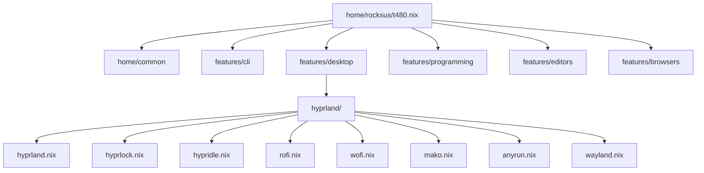

# Home Manager

User environment managed by home-manager for user `rocksus` across all four hosts.

## Structure

```
home/
    common/default.nix        # shared across all home configs
    features/                 # categorized feature modules
        browsers/
        cli/                  # fzf, helix, yazi, zsh
        design/
        desktop/              # fonts, hyprland/, libnotify, media, office, slack, swww/
        editors/vscode/
        programming/          # languages/, terminals/, utilities/
    rocksus/                  # per-host home entry points
        home.nix
        t480.nix
        m920q.nix
        lv001.nix
        homelab-hz.nix
```

## Composition model

Each `home/rocksus/<host>.nix` imports `home/common` and selects feature modules from `home/features/<category>/default.nix`. The `default.nix` in each feature category aggregates the individual feature files.

## Feature categories

- **cli** - fzf, helix, yazi, zsh
- **desktop** - Hyprland stack (hyprland, hypridle, hyprlock, anyrun, rofi, wofi, mako, wayland), fonts, swww wallpapers, libnotify, media, office, slack
- **editors** - vscode
- **programming** - languages (c, go, nix, node, python, rust), terminals, utilities (bruno, cherry-studio, dbeaver, devenv, duckdb, flyctl, obsidian, opencode, postgres)

## Mermaid: composition



## Invariants

- Per-host home entry must exist in `home/rocksus/<host>.nix` AND be wired in `flake.nix` `homeConfigurations`.
- Feature files stay single-topic; aggregation only in `default.nix`.

Related: [../flake/inputs.md](../flake/inputs.md), [../hosts/summary.md](../hosts/summary.md).
