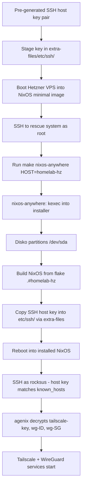

# homelab-hz

Remote homelab node (HZ region). x86_64 Hetzner VPS.

## Location

`hosts/homelab-hz/`:
- `default.nix`, `configuration.nix`, `hardware-configuration.nix`, `disko-config.nix`, `secrets.nix`
- `services/`: `containers/`, `default.nix`

## Role

Remote homelab compute node running containers (Podman).

## Wiring in flake

`nixosConfigurations.homelab-hz` + `homeConfigurations."rocksus@homelab-hz"`. Modules: disko, agenix.

## Boot loader

Uses **systemd-boot** (UEFI). The grub block was removed from `hardware-configuration.nix` to avoid conflict with `configuration.nix`'s `systemd-boot.enable = true`. The ESP partition is mounted at `/boot` (defined in `disko-config.nix`), which is what systemd-boot expects.

## Disk layout

Single disk (`primary`, `/dev/sda`) via disko:
- `boot`: 1M EF02 (BIOS boot partition)
- `ESP`: 512M vfat, mounted at `/boot`
- `root`: 100% ext4, mounted at `/`

## Provisioning with nixos-anywhere

This host is provisioned remotely using [nixos-anywhere](https://github.com/nix-community/nixos-anywhere) against a Hetzner VPS booted into a NixOS minimal/rescue image.

### Makefile target

```bash
make nixos-anywhere \
  HOST=homelab-hz \
  TARGET_IP=<vps-ip> \
  SSH_PORT=<port> \
  EXTRA_FILES_DIR=<path-to-staged-keys>
```

The target runs:
```
nix run github:nix-community/nixos-anywhere -- \
  --flake .#homelab-hz \
  --extra-files <EXTRA_FILES_DIR> \
  --ssh-port <SSH_PORT> \
  root@<TARGET_IP>
```

### agenix host key injection (critical)

agenix secrets (`tailscale-key`, `wg-ID`, `wg-SG`) are encrypted to the homelab-hz SSH host public key registered in `secrets.nix`:

```
ssh-ed25519 AAAAC3NzaC1lZDI1NTE5AAAAINqFCDKi2cDb2t0lX0O5rdn8b+vNXPrKcZbdcomN02Tx
```

On a fresh install, the target generates a **new** SSH host key that won't match. To solve this, the pre-generated private key is injected via `--extra-files`:

1. Stage the key pair outside the repo (it contains a private key):
   ```
   <EXTRA_FILES_DIR>/
     etc/ssh/ssh_host_ed25519_key      # chmod 600
     etc/ssh/ssh_host_ed25519_key.pub  # chmod 644
   ```
2. Verify the `.pub` matches the key in `secrets.nix`.
3. nixos-anywhere copies these into the target's `/etc/ssh/` before first boot.
4. On first boot, agenix decrypts secrets using the matching host key.

### Post-install verification

After reboot, SSH in as `rocksus` and verify:
- `/run/agenix/tailscale-key` exists and is readable
- `/etc/wireguard/ID.conf` and `/etc/wireguard/SG.conf` exist
- `systemctl status tailscaled` is active

If secrets fail to decrypt, the injected host key doesn't match `secrets.nix` — re-encrypt secrets with `agenix -r` and rebuild.

## Workflow diagram



Related: [summary.md](summary.md), [practices.md](../practices.md).
