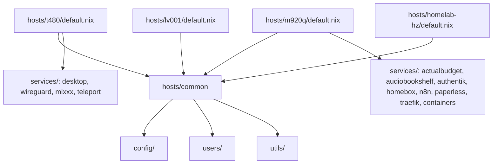

# Hosts

The fleet: four NixOS hosts, each declared in `hosts/<name>` and wired in `flake.nix`.

## Per-host snapshot

| Host | Role | Hardware | Disko | Services |
|---|---|---|---|---|
| `t480` | Primary laptop (ThinkPad T480) | x86_64 | yes | desktop, wireguard, mixxx, teleport |
| `m920q` | Homelab server (Lenovo M920q) | x86_64 | yes | actualbudget, audiobookshelf, authentik, homebox, n8n, paperless, traefik, containers |
| `lv001` | Homelab node | x86_64 | yes | (see `hosts/lv001/services`) |
| `homelab-hz` | Remote homelab node (HZ region) | x86_64 | yes | (see `hosts/homelab-hz/services`) |

## Common modules (`hosts/common`)

Shared by all hosts via `hosts/<name>/default.nix`:

- `config/` - locale, system config (audio, bluetooth, filesystem, network, thunar)
- `users/` - `rocksus` user definition
- `utils/` - 1password, nh, openssh, podman, tailscale

## Per-host file shape

Every `hosts/<name>/` contains:
- `default.nix` - imports common + host-specific modules
- `configuration.nix` - host boot/init/network
- `hardware-configuration.nix` - generated hardware config
- `disko-config.nix` - declarative disk layout
- `secrets.nix` - agenix secret bindings
- `services/` - host-specific services

## Mermaid: composition

See per-host lodes: [t480.md](t480.md), [m920q.md](m920q.md), [lv001.md](lv001.md), [homelab-hz.md](homelab-hz.md).
